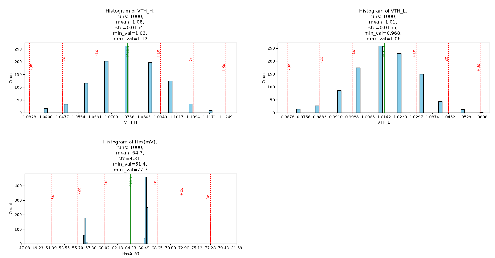
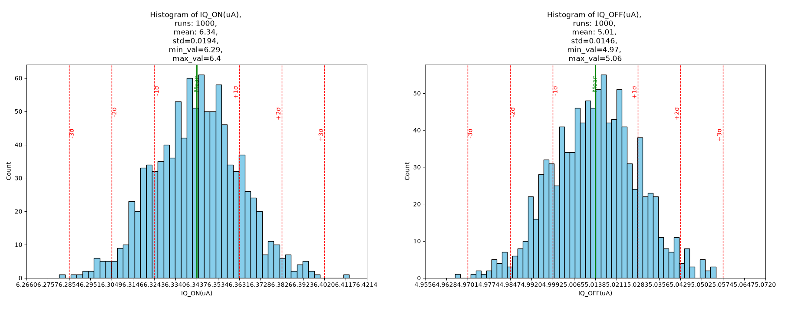
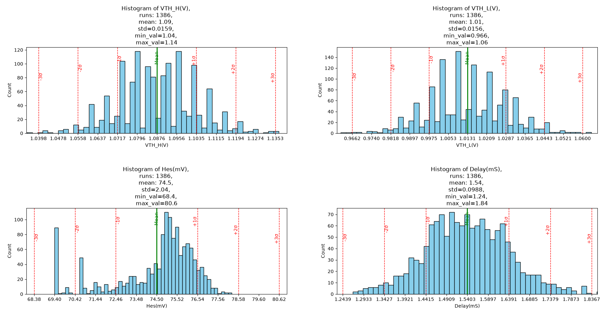
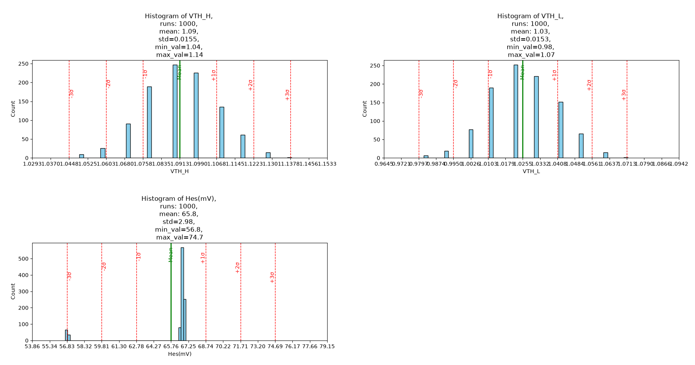
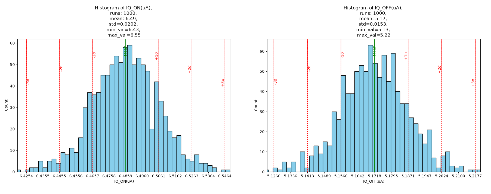
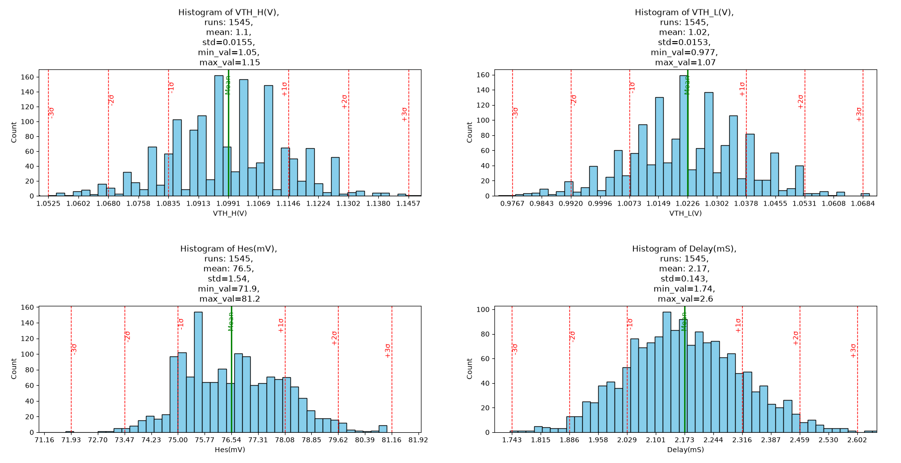

**SG13CMOS5L\_LPSVS**  
   
Low-Power Voltage Supervisor (LPSVS) for 1.2 V core supply monitoring, integrating Power-On Reset (POR), Brown-Out Reset (BOR), hysteresis-based voltage detection, and reset-delay functionality.  
   
***LPVSV Block Description:***  
   
**Analog/ Mixed Signal IP Block**  
   
**Low Power Voltage Supervisor (*LPVSV*)** that monitors the ***1V2*** regulated supply generated (***VCORE***) by the on-chip    ***LDO***. The supervisor  ***LPVSV*** ensures reliable startup and operation of the digital core by generating Power-On reset (***POR***) and Brown-Out Reset (***BOR***) signals whenever the regulated outside its safe operating range.  
   
The ***LPVSV*** assert the ***RESET*** during startup until the ***1V2*** reaches its normal value and remain stable for a predefine delay. During normal operation, if the ***1V2*** drops below the brown out threshold due to an ***LDO*** failure, overload or supply disturbance, the ***LPVSV*** immediately deasserts the  ***RESET*** to protect the digital core.

   
**Target Specifications**  
   
 Since the ***LDO*** output specification is **1.2 V ±10%**, the ***LPVSV*** thresholds should be based on that.

| **Parameter**       | **Symbol**   | **Min** | **Typ** | **Max** | **Unit** |
| :-: | :-: | :-: | :-: | :-: | :-: |
| Supply Voltage        | ***VDD***    | 2.7     | 3.3     | 3.6     | V  |
| Temperature           | ***T***      | -40     | 27      | 125     | °C |
| Monitored Voltage     | ***VCORE***  | 0       | 1.2     | 1.3     | V  |
| Power-On Threshold    | ***Vth\_H*** | 1.02    | 1.08    | 1.14    | V  |
| Brown-Out Threshold   | ***Vth\_L*** | 0.94    | 1       | 1.06    | V  |
| Hysteresis            | ***HYS***    | 50      | 80      | 100     | mV |
| Threshold Accurancy   | ***TH\_AC*** | -       | ±5      | ±7.5    | %  |
| Quiescent Current ON  | ***IQ\_ON*** | -       | 5       | 10      | uA | 
| Quiescent Current OFF | ***IQ\_OFF***| -       | 5       | 10      | uA |
| Short Glitches        | ***SG***     | -       | 1       | 2       | uS |
| Reset Delay           | ***Delay***  | ***3*** | ***5*** | ***6*** | mS |

### Pre-Layout Simulation :
**DC Tests:**  
**Monte Carlo 1000 runs:**

|  | VTH\_H (V) | VTH\_L (V) | Hes (mV) | IQ\_ON (uA) | IQ\_OFF (uA) |
| :-: | :-: | :-: | :-: | :-: | :-: |
| **Mean**      | 1.08   | 1.01   | 64.3  | 6.34   | 5.01   |
| **Min**       | 1.03   | 0.968  | 51.4  | 6.29   | 4.97   |
| **Max**       | 1.12   | 1.06   | 77.3  | 6.4    | 5.06   |
| **STD**       | 0.0154 | 0.0155 | 4.31  | 0.0194 | 0.0146 |
| **±3segma %** | 0.0462 | 0.0465 | 12.93 | 0.0582 | 0.0438 |

**PVT Corners:**
**Temperature = -40/125, VDD = 2.7/3.6V, I\_Bais = 0.98/1.02uA**

|  |  | Value | Temp (C) | VDD (V) | I\_Bais (uA) | LV | HV |
| :-: | :-: | :-: | :-: | :-: | :-: | :-: | :-: |
|  ***VTH\_H (V)***  | **Max** | **1.158** | **-40** | **3.6** | **1.02** | **SS** | **SS** |
|                    | **Min** | **0.979** | **125** | **2.7** | **0.98** | **FF** | **FF** |
|  ***VTH\_L (V)***  | **Max** | **1.102** | **-40** | **3.6** | **1.02** | **SS** | **SS** |
|                    | **Min** | **0.902** | **125** | **2.7** | **0.98** | **FF** | **FF** |
|   ***Hes (mV)***   | **Max** | **86.50** | **125** | **3.6** | **1.02** | **SS** | **SS** |
|                    | **Min** | **46.63** | **-40** | **2.7** | **0.98** | **SS** | **SS** |
| ***IQ\_ON (uA)***  | **Max** | **7.080** | **-40** | **3.6** | **1.02** | **FF** | **FF** |
|                    | **Min** | **5.648** | **125** | **2.7** | **0.98** | **SS** | **SS** |
| ***IQ\_OFF (uA)*** | **Max** | **5.561** | **-40** | **3.6** | **1.02** | **FF** | **FF** |
|                    | **Min** | **4.497** | **125** | **2.7** | **0.98** | **SS** | **SS** |

**Transient Tests**  
**Monte Carlo 1386 runs:**

|  | VTH\_H (V) | VTH\_L (V) | Mes (mV) | Delay (mS) |
| :-: | :-: | :-: | :-: | :-: |
| **Mean**      | 1.09   | 1.01   | 74.5 | 1.54   |
| **Min**       | 1.04   | 0.966  | 68.4 | 1.24   |
| **Max**       | 1.14   | 1.06   | 80.6 | 1.84   |
| **STD**       | 0.0159 | 0.0156 | 2.04 | 0.0988 |
| **±3segma %** | 0.0477 | 0.0468 | 6.12 | 0.296  |

**PVT Corners:**
**Temperature = -40/125, VDD = 2.7/3.6V, I\_Bais = 0.98/1.02uA**

|  |  | Value | Temp (C) | VDD (V) | I\_Bais (uA) | HV | LV |
| :-: | :-: | :-: | :-: | :-: | :-: | :-: | :-: |
| ***VTH\_H (V)*** | **Max** | **1.168** | **-40** | **3.6** | **1.02** | **SS** | **SS** |
|                  | **Min** | **0.982** | **125** | **2.7** | **0.98** | **FF** | **FF** |
| ***VTH\_L (V)*** | **Max** | **1.103** | **-40** | **3.6** | **1.02** | **SS** | **SS** |
|                  | **Min** | **0.902** | **125** | **2.7** | **0.98** | **FF** | **FF** |
|  ***Hes (mV)***  | **Max** | **90.16** | **125** | **3.6** | **1.02** | **SS** | **SS** |
|                  | **Min** | **57.77** | **-40** | **2.7** | **0.98** | **FF** | **FF** |
| ***Delay (mA)*** | **Max** | **1.940** | **-40** | **2.7** | **0.98** | **FF** | **FF** |
|                  | **Min** | **0.854** | **125** | **3.6** | **1.02** | **FF** | **FF** |
| ***SG (nS)***    | **Max** | **550**   | **125** | **2.7** | **0.98** | **SS** | **SS** |
|                  | **Min** | **400**   | **-40** | **3.6** | **1.02** | **FF** | **FF** |

### Post-Layout Simulation :
**DC Tests:**  
**Monte Carlo 1000 runs:**

|  | VTH\_H (V) | VTH\_L (V) | Hes (mV) | IQ\_ON (uA) | IQ\_OFF (uA) |
| :-: | :-: | :-: | :-: | :-: | :-: |
| **Mean**      | 1.09   | 1.03   | 65.8  | 6.49   | 5.17   |
| **Min**       | 1.04   | 0.98   | 56.8  | 6.43   | 5.13   |
| **Max**       | 1.14   | 1.07   | 74.7  | 6.55   | 5.22   |
| **STD**       | 0.0155 | 0.0153 | 2.98  | 0.0202 | 0.0153 |
| **±3segma %** | 0.0465 | 0.0459 | 8.94  | 0.0606 | 0.0459 |

**PVT Corners:**
**Temperature = -40/125, VDD = 2.7/3.6V, I\_Bais = 0.98/1.02uA**

|  |  | Value | Temp (C) | VDD (V) | I\_Bais (uA) | LV | HV |
| :-: | :-: | :-: | :-: | :-: | :-: | :-: | :-: |
|  ***VTH\_H (V)***  | **Max** | **1.178** | **-40** | **3.6** | **1.02** | **SS** | **SS** |
|                    | **Min** | **0.989** | **125** | **2.7** | **0.98** | **FF** | **FF** |
|  ***VTH\_L (V)***  | **Max** | **1.121** | **-40** | **3.6** | **1.02** | **SS** | **SS** |
|                    | **Min** | **0.912** | **125** | **2.7** | **0.98** | **FF** | **FF** |
|   ***Hes (mV)***   | **Max** | **86.45** | **125** | **3.6** | **1.02** | **FF** | **SS** |
|                    | **Min** | **47.20** | **-40** | **2.7** | **0.98** | **SS** | **FF** |
| ***IQ\_ON (uA)***  | **Max** | **7.442** | **-40** | **3.6** | **1.02** | **FF** | **FF** |
|                    | **Min** | **5.712** | **125** | **2.7** | **0.98** | **SS** | **SS** |
| ***IQ\_OFF (uA)*** | **Max** | **5.911** | **-40** | **3.6** | **1.02** | **FF** | **FF** |
|                    | **Min** | **4.573** | **125** | **2.7** | **0.98** | **SS** | **SS** |

**Transient Tests**  
**Monte Carlo 1545 runs:**

|  | VTH\_H (V) | VTH\_L (V) | Mes (mV) | Delay (mS) |
| :-: | :-: | :-: | :-: | :-: |
| **Mean**      | 1.10   | 1.02   | 76.5 | 2.17   |
| **Min**       | 1.05   | 0.977  | 71.9 | 1.74   |
| **Max**       | 1.15   | 1.07   | 81.2 | 2.60   |
| **STD**       | 0.0155 | 0.0153 | 1.54 | 0.143  |
| **±3segma %** | 0.0465 | 0.0459 | 4.62 | 0.429  |

**PVT Corners:**
**Temperature = -40/125, VDD = 2.7/3.6V, I\_Bais = 0.98/1.02uA**

|  |  | Value | Temp (C) | VDD (V) | I\_Bais (uA) | HV | LV |
| :-: | :-: | :-: | :-: | :-: | :-: | :-: | :-: |
| ***VTH\_H (V)*** | **Max** | **1.187** | **-40** | **3.6** | **1.02** | **SS** | **SS** |
|                  | **Min** | **0.989** | **125** | **2.7** | **0.98** | **FF** | **FF** |
| ***VTH\_L (V)*** | **Max** | **1.120** | **-40** | **3.6** | **1.02** | **SS** | **SS** |
|                  | **Min** | **0.907** | **125** | **2.7** | **0.98** | **FF** | **FF** |
|  ***Hes (mV)***  | **Max** | **91.82** | **125** | **3.6** | **1.02** | **SS** | **SS** |
|                  | **Min** | **59.59** | **-40** | **2.7** | **0.98** | **FF** | **FF** |
| ***Delay (mA)*** | **Max** | **3.302** | **-40** | **2.7** | **0.98** | **FF** | **FF** |
|                  | **Min** | **0.975** | **125** | **3.6** | **1.02** | **FF** | **FF** |
| ***SG (nS)***    | **Max** | **550**   | **125** | **2.7** | **0.98** | **SS** | **SS** |
|                  | **Min** | **400**   | **-40** | **3.6** | **1.02** | **FF** | **FF** |

