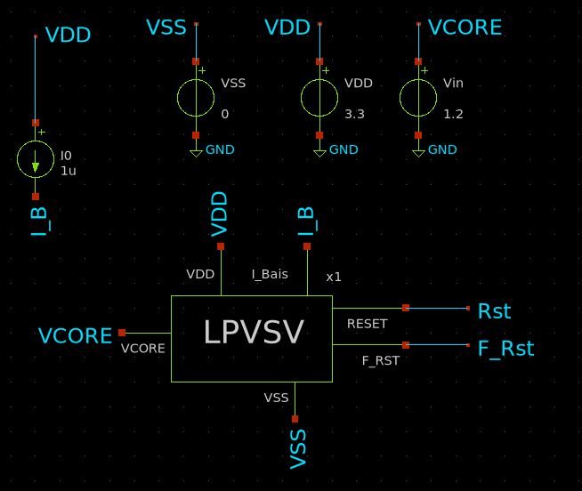

**SG13CMOS5L\_LPSVS**  
   
Low-Power Voltage Supervisor (LPSVS) for 1.2 V core supply monitoring, integrating Power-On Reset (POR), Brown-Out Reset (BOR), hysteresis-based voltage detection, and reset-delay functionality.  
   
***LPVSV Block Description:***  
   
**Analog/ Mixed Signal IP Block**  
   
**Low Power Voltage Supervisor (*LPVSV*)** that monitors the ***1V2*** regulated supply generated (***VCORE***) by the on-chip    ***LDO***. The supervisor  ***LPVSV*** ensures reliable startup and operation of the digital core by generating Power-On reset (***POR***) and Brown-Out Reset (***BOR***) signals whenever the regulated outside its safe operating range.  
   
The ***LPVSV*** assert the ***RESET*** during startup until the ***1V2*** reaches its normal value and remain stable for a predefine delay. During normal operation, if the ***1V2*** drops below the brown out threshold due to an ***LDO*** failure, overload or supply disturbance, the ***LPVSV*** immediately deasserts the  ***RESET*** to protect the digital core.

   
**Target Specifications**  
   
 Since the ***LDO*** output specification is **1.2 V ±10%**, the ***LPVSV*** thresholds should be based on that.

| **Parameter** | **Symbol** | **Min** | **Typ** | **Max** | **Unit** |
| :-: | :-: | :-: | :-: | :-: | :-: |
| Supply Voltage | ***VDD*** | 2.7 | 3.3 | 3.6 | V |
| Temperature | ***T*** | -40 | 27 | 125 | °C |
| Monitored Voltage | ***VCORE*** | 0 | 1.2 | 1.3 | V |
| Power-On Threshold | ***Vth\_H*** | 1.02 | 1.08 | 1.14 | V |
| Brown-Out Threshold | ***Vth\_L*** | 0.94 | 1 | 1.06 | V |
| Hysteresis | ***HYS*** | 50 | 80 | 100 | mV |
| Threshold Accurancy | ***TH\_AC*** | - | ±5 | ±7.5 | % |
| Quiescent Current | ***IQ*** | - | 5 | 10 | uA |
| Propagation Delay | ***PDT*** | - | 2 | 5 | uS |
| Reset Delay | ***RDT*** | ***3*** | ***5*** | ***6*** | mS |

**DC Tests:**  
**Monte Carlo 1000 runs:**

|  | VTH\_H (V) | VTH\_L (V) | Hes (mV) | IQ(uA) |
| :-: | :-: | :-: | :-: | :-: |
| **Mean** | 1.078 | 1.0136 | 64.46 | 6.29 |
| **Min** | 1.032 | 0.967 | 51.74 | 6.21 |
| **Max** | 1.124 | 1.055 | 77.18 | 6.38 |
| **STD** | 0.0151 | 0.0153 | 4.23 | 0.028 |
| **±3segma %** | 4.2 | 4.5 | 19.7 | 1.34 |

**Transient Tests**  
**Monte Carlo 100 runs:**

|  | VTH\_H (V) | VTH\_L (V) | Mes (mV) | Delay (mS) |
| :-: | :-: | :-: | :-: | :-: |
| **Mean** | 1.078 | 1.013 | 65.13 | 5.67 |
| **Min** | 1.023 | 0.959 | 63.7 | 2.2 |
| **Max** | 1.133 | 1.067 | 66.6 | -0.93 |
| **STD** | 0.0182 | 0.0179 | 0.47 | 12.36 |
| **±3segma %** | 5.06 | 5.3 | 2.18 | 116 |

### PVT Corners :

### Temperature = -40/125, VDD = 2.7/3.6V, I\_Bais = 0.98/1.02uA

|  |  | Value | Temp (C) | VDD (V) | I\_Bais (uA) | HV | LV |
| :-: | :-: | :-: | :-: | :-: | :-: | :-: | :-: |
| ***VTH\_H (V)*** | **Max** | **1.163** | **-40** | **3.6** | **1.02** | **SS** | **SS** |
|  | **Min** | **0.977** | **125** | **2.7** | **0.98** | **FF** | **FF** |
| ***VTH\_L (V)*** | **Max** | **1.103** | **-40** | **3.6** | **1.02** | **SS** | **SS** |
|  | **Min** | **0.902** | **125** | **2.7** | **0.98** | **FF** | **FF** |
| ***Hes (mV)*** | **Max** | **84.6** | **125** | **3.6** | **1.02** | **SS** | **SS** |
|  | **Min** | **53.3** | **-40** | **2.7** | **0.98** | **FF** | **FF** |
| ***Delay (mA)*** | **Max** | **16.8** | **-40** | **2.7** | **0.98** | **FF** | **FF** |
|  | **Min** | **0.135** | **125** | **3.6** | **1.02** | **SS** | **SS** |

